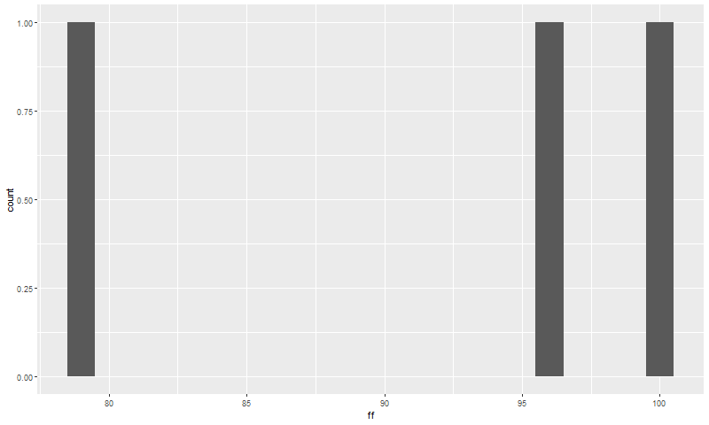

Here --> **Simulations** from a Binomial and a Multinomial Distributions

# Setting up

```{r}
library(tidyverse)  # ggplot2, dplyr, tidyr, readr, 
                   # purrr, tibble, stringr, forcats
library(RVAideMemoire)
library(XNomial)
library(DescTools)
library(animation) # saveGIF
getwd()
```

# Loading in the data

```{r Data preparation}
horror_movies <- readr::read_csv("https://raw.githubusercontent.com/rfordatascience/tidytuesday/master/data/2019/2019-10-22/horror_movies.csv")

dim(horror_movies)

horror_date <-  horror_movies %>% 
                separate(
                  release_date, 
                  c("day", "month", "year"),
                  sep = "-")

horror_date$day <- as.numeric(horror_date$day)

# Remove rows without Date of the month

horror_date <- horror_date %>% filter(day < 32) 

# I am excluding Day 1 from the analysis (Most aggreements starts at 1st)

horror_date_table <- horror_date %>% filter(day > 1)

# Let's check what is the most common day in the month for orror movie releases

hd <-  horror_date_table %>%
  group_by(day) %>% 
  count() %>% 
  arrange(desc(n))
```

# How to examine categorical data? 

To make an important decision businesses often need to analyze categorical data. You may use t-test or ANOVA when comparing measurement data such has weight, length and so on. But here we have counts (attribute) data. Total number of movies released are put in categories according to the day of the month. 

The cleaned data consists of number of movies released in each day in the month. 

My hypothesis is that **movies are equally likely to be released each day in the month.**

And Chi squared test can answer whether the distribution from our sample is aligned with this hypothesis and answer the question whether number of movies released dependent on the day in the month?


# Chi-squared Goodness-of-fit (test for one variable sample)

Godness-of-fit refers to how close the observed data are to the ones predcited from the hypothesis.
Chi square (X^2) is a statistic which summarizes the differences between observed and expected values or frequencies.
Chi square values are compared to the Chi Square distributions corresponding to same degrees of freedom and p value is calculated whether we can reject the null hypothesis. However, like in other tests, p value does not prove that a null hypothesis is correct. It can only be used to reject or failing to reject a null hypothesis. 


```{r}
stats::chisq.test(hd$n)
```

A p value lower than 0.05 points that the number of movies released is dependent on the day in the month.

# Pairwise chisq.test

If I am interested also in which two specific days the number of movie releases are different I need to adjust for multiple hypothesis testing. I can use chisq.multcomp() function of RVAideMemoire package. 

```{r pairwise chisq.test} 
# Pairwise chisq.test
RVAideMemoire::chisq.multcomp(hd$n, p.method = "fdr")
```


# Monte Carlo methods for finding probabilities 

To test if our movie counts fit a specified multinomial distribution (e.g. here 1/30) I can use 
xmonte function from XNomial package. It does this by simulating a large number of random outcomes and finding the probability of those cases which deviate from the expectation by at least as much as the observed.

```{r xnomial} 
# Monte carlo method
XNomial::xmonte(hd$n, rep(1/30, 30), ntrials = 100000)

```

# Exact binom.test for calculating probabilities

The following will make an exact **binom test** for all the observations in our data

```{r}
binoms <- list()
pvalues <- list()

for(i in 1:30) { 
  binoms[[i]] <- binom.test(hd$n[i],2782, 1/30) 
  pvalues[[i]] <- binoms[[i]]$p.value 
  }

pvalues[[1]]
pvalues[[2]]
```


# Simulate probabilities with monte carlo methods

I will simulate 100.000 trials of distributing 2782 movies to 30 categories.

```{r, monte carlo 1}
# Simulate 100.000 multinomial trial with k=30
# Create a matrix from the random multinomial trials (30 x 100.000)
pr <-  rep(1/30, 30)
ff <- rmultinom(100000, size=2782, prob=pr)
a <- list()

# Calculate the probability of each category (day) having
# more than or equal to 124

for (i in 1:30){ a[[i]] <- mean(ff[i,1:100000] >=124) }

# Sum the total probabilities
p_val_124a <-  2 * do.call(sum,a)/30  # I need to divide by 30 since each day has 1/30 chance 

p_val_124a 
```

Alternative way: 

```{r monte carlo 2}
pr <-  rep(1/30, 30)
ff <- rmultinom(100000,size=2782, prob=pr)
a <- list()

# Calculate the probability of having more than 124 in each 1 of 100000 trials of multinomial simulation 
for (i in 1:100000){ a[[i]] <- mean(ff[1:30, i] >=124) }

# And sum all the probabilities

p_val_124b <-  2 * do.call(sum,a)/100000
p_val_124b
```


# Confidence intervals for each category

To find confident intervals for each day, I can use MultinomCI function from DescTools

```{r, multinomCI}
# Apply multinomCI to find the confidence interval for each day

DescTools::MultinomCI(hd$n, conf.level = 0.95, sides = "two.sided", method = "wilson")
```

The list shows that the mean 0.03333 is not in the 95% interval 
for the days(124,119,119,74, 65).

# How to simulate multinomial probabilities

I will simulate 100000 multinomial trials with k=30 and plot the probability density distributions.

```{r, simulating multinomial trial}

# With 100000 Random simulation

ff <- rmultinom(100000,size=2782, prob=pr)

movies <- rbinom(100000, 2782, 1/30)
movies <- data.frame(movies)

ft <- t(ff)
colnames(ft) <-  paste0("D", 1:30)
ft <- data.frame(ft)
full <- cbind(ft,movies)
f_tall <- full %>% tidyr::gather(day, value)

f_tall %>% ggplot(aes(x=value, col=day)) + geom_density()
```


## Animation of the simulation of a multinomial distribution with 30 Categories **(Density plot)**


```{r}
master <- list()
seq <- c(3,10,30,100,300,1000,3000,10000,30000,100000)
for (i in 1:10){
ff <- rmultinom(seq[i],size=2782, prob=pr)
ft <- t(ff)
colnames(ft) <-  paste0("D", 1:30)
ft <- data.frame(ft)
f_tall <- ft %>% gather(day, value)
master[[i]] <- f_tall %>% ggplot(aes(x=value, col=day)) + geom_density() + 
  theme(title = element_text(size = 28)) +
  labs(title = paste0("number of trials = ", seq[i])) }
```


```{r, eval=FALSE}
saveGIF({
    for(i in 1:10) plot(master[[i]])
},movie.name = "multinomial.gif", interval = 1, nmax = 30, 
ani.width = 800)
```


## Simulation of a multinomial distribution with 30 Categories **(Density plot)** COMBINED

```{r}
master <- list()
seq <- c(3,10,30,100,300,1000,3000,10000,30000,100000)
for (i in 1:10){
ff <- rmultinom(seq[i],size=2782, prob=pr)
ft <- t(ff)
colnames(ft) <-  paste0("D", 1:30)
ft <- data.frame(ft)
f_tall <- ft %>% gather(day, value)
master[[i]] <- f_tall %>% ggplot(aes(x=value)) + geom_density() +
  labs(title = paste0("number of trials = ", seq[i])) }
```


```{r, eval=FALSE}
saveGIF({
    for(i in 1:10) plot(master[[i]])
},movie.name = "multinomial_comb_density.gif", interval = 1, nmax = 30, 
ani.width = 800)


```


## Simulation of a **binomial distribution** with 30 Categories **

```{r}
master <- list()
seq <- c(3,10,30,100,300,1000,3000,10000,30000,100000)
for (i in 1:10){
ff <- rbinom(seq[i],size=2782, prob=1/30)
ff <- data.frame(ff)
master[[i]] <- ff %>% ggplot(aes(x=ff)) + geom_density()  }
```


```{r, eval=FALSE}
saveGIF({
    for(i in 1:10) plot(master[[i]])
},movie.name = "binomial.gif", interval = 0.5, nmax = 30, 
ani.width = 800)

```


## Simulation of a binomial distribution with 30 Categories

```{r}
master <- list()
seq <- c(3,10,30,100,300,1000,3000,10000,30000,100000)
for (i in 1:10){
ff <- rbinom(seq[i],size=2782, prob=1/30)
ff <- data.frame(ff)
master[[i]] <- ff %>% ggplot(aes(x=ff)) + geom_histogram(binwidth=1)  }
```


```{r}
saveGIF({
    for(i in 1:10) plot(master[[i]])
},movie.name = "binomial_hist.gif", interval = 0.5, nmax = 30, 
ani.width = 800)
```



## Simulation of a multinomial distribution with 30 Categories (**histogram**)
```{r}
master <- list()
seq <- c(3,10,30,100,300,1000,3000,10000,30000,100000)
for (i in 1:10){
    ff <- rmultinom(seq[i],size=2782, prob=pr)
    ft <- t(ff)
    colnames(ft) <-  paste0("D", 1:30)
    ft <- data.frame(ft)
    f_tall <- ft %>% gather(day, value)
    master[[i]] <- f_tall %>% ggplot(aes(x=value, col=day)) + 
      geom_histogram(binwidth = 1)
    }
```


```{r, eval=FALSE}
saveGIF({
    for(i in 1:10) plot(master[[i]])
},movie.name = "multinomial_hist.gif", interval = 0.5, nmax = 30, 
ani.width = 800)
```

